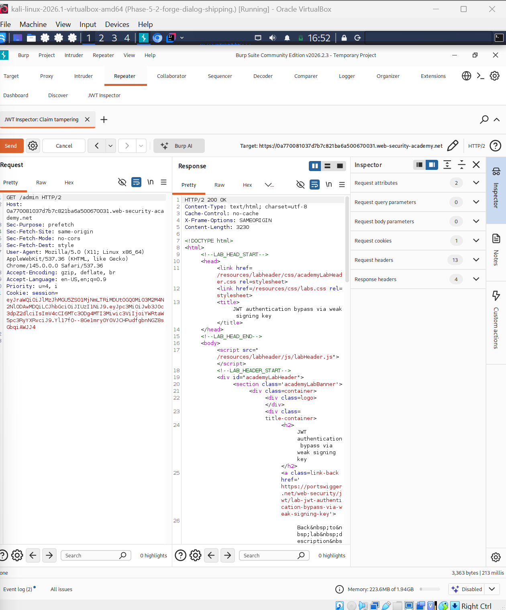
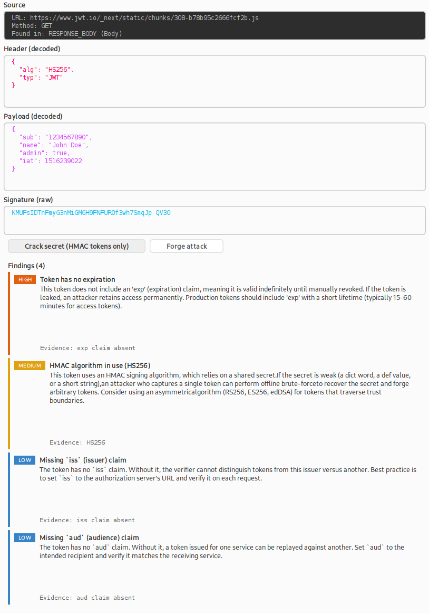
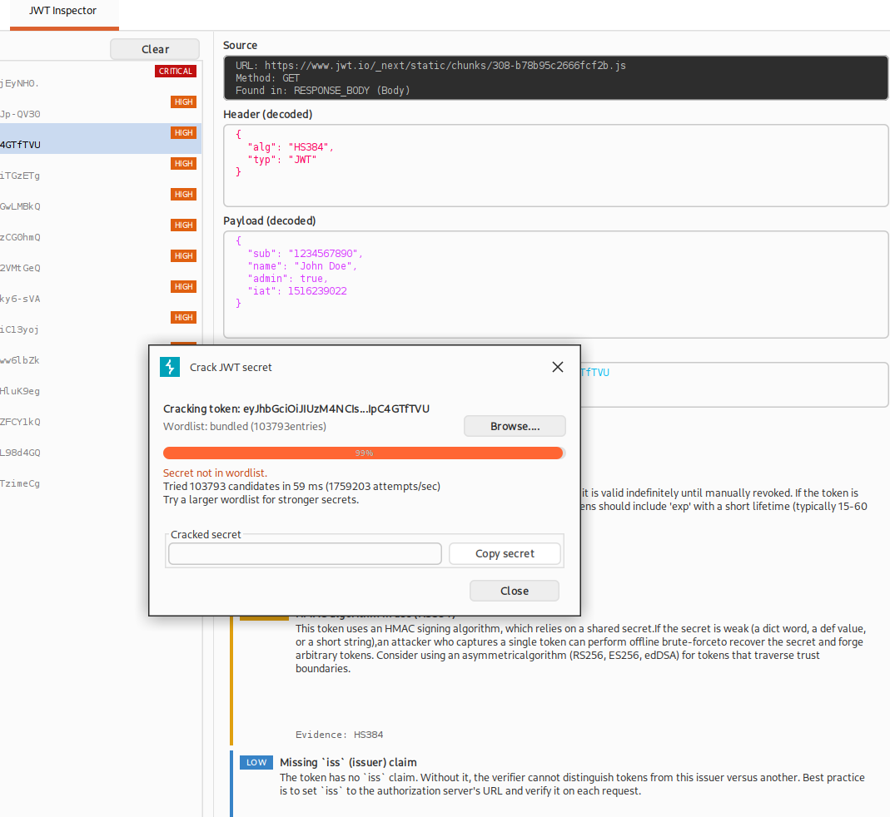
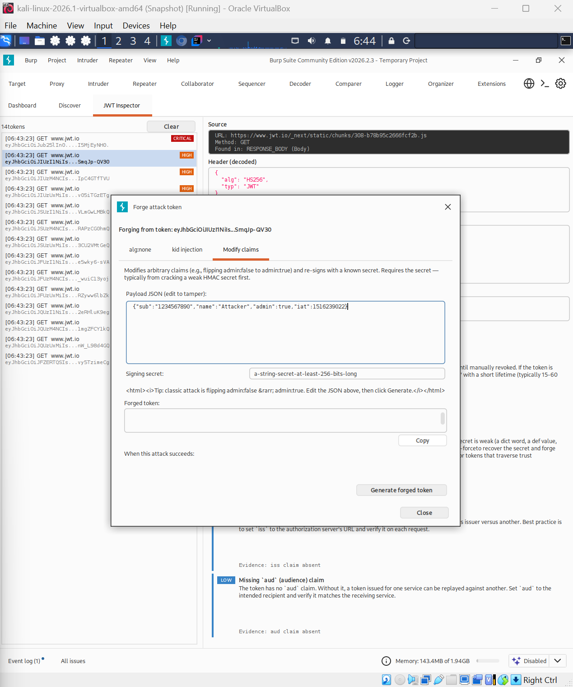
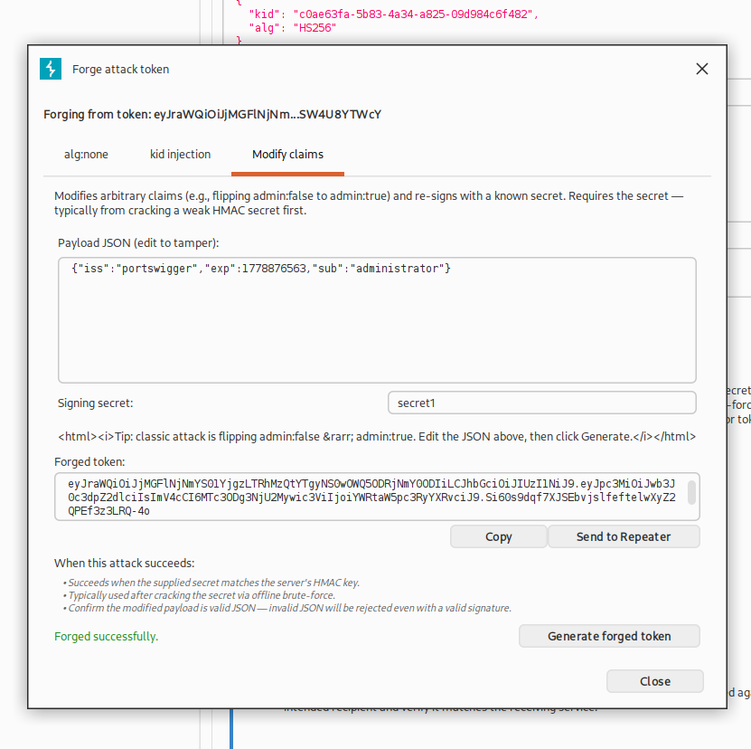
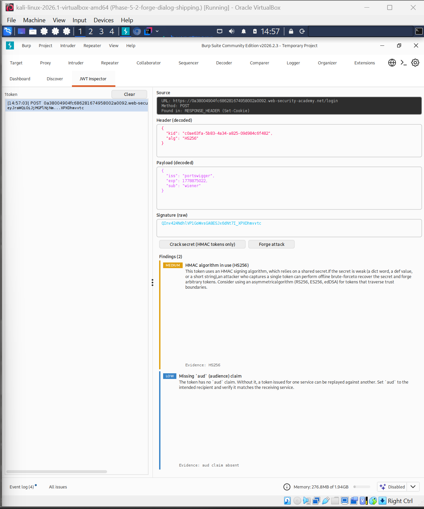

# Burp JWT Inspector

A Burp Suite extension that automates the full JWT attack chain — **detect, analyse, crack, forge, replay** — from inside the proxy. Designed to take the friction out of JWT security testing and to teach as it goes.



*Forged session cookie accepted by the PortSwigger Web Security Academy "JWT authentication bypass via weak signing key" lab — full chain executed through the extension's UI.*

---

## What it does

- **Passively detects** JWTs in every request and response Burp proxies — Authorization headers, Cookie headers, custom auth headers, query parameters, request bodies, response bodies.
- **Analyses** every token against six vulnerability checks with severity-ranked findings: `alg:none`, weak algorithm, missing expiration, long lifetime, `kid` injection patterns, missing standard claims.
- **Cracks** HMAC secrets offline at ~1.5 million attempts per second against a bundled 103,789-entry wordlist of real-world leaks (Wallarm's `jwt.secrets.list` merged with framework defaults). Custom wordlists supported via Browse button.
- **Forges** three attack payloads from any detected token: `alg:none` stripping, `kid` header injection, and arbitrary claim tampering re-signed with a known (typically cracked) HMAC secret.
- **Replays** forged tokens straight into Burp's Repeater with a single click — auto-substitutes the forged token into the original request's Authorization header, Cookie, or wherever the token was originally observed.

## Why this exists

Existing Burp extensions for JWT analysis (notably PortSwigger's "JWT Editor") cover encoding and signing well but require the operator to manually orchestrate the workflow: copy a token out, paste into a cracker, copy the secret back, hand-edit claims, paste back into Repeater.

This extension collapses that workflow into the proxy. Token detection is automatic, analysis surfaces findings against the standard JWT vulnerability classes, cracking and forging are wired together so the cracked secret pre-fills the forge dialog, and the forged token can be sent to Repeater in one click. The goal is to reduce a 5-minute attack chain to under 30 seconds and to let the operator concentrate on the target rather than the tooling.

The findings panel and forge dialog also include short pedagogical notes — *when* each attack works, what server behaviour it targets — so the tool functions as a learning resource as well as an attack utility.

## Screenshots

### JWT Inspector tab
Detection, decoded header/payload/signature, severity-ranked findings, action buttons.



### Crack dialog
Off-EDT cracking with live progress, attempts per second, and cancellation. The screenshot shows 103,793 candidates exhausted in 59 milliseconds against an HS384 token (1.76M attempts/sec on a Kali VM with 4 cores).



### Forge dialog
Three tabs, one per attack. The Modify claims tab pre-fills with the original payload and the cracked secret (if available), so the user can edit a single claim and re-sign in seconds.



### Send to Repeater
One-click replay: the forged token is substituted into the original request's auth surface (Authorization header, session cookie, or custom location) and a named Repeater tab is opened.



---

## Quickstart

### Requirements
- Burp Suite Community or Professional 2024.x or later (Montoya API)
- Java 21+ (for building from source only — the prebuilt JAR runs on Burp's bundled JRE)

### Run the prebuilt JAR

1. Download `burp-jwt-inspector-0.5.3.jar` from the [Releases](../../releases) page.
2. In Burp: *Extensions → Add → Java →* select the JAR.
3. Confirm the *Output* tab shows `JWT Inspector loaded successfully` and `Version: 0.5.3`.
4. A new top-level tab `JWT Inspector` appears.

### Build from source

```bash
git clone https://github.com/Tauqeerkhan187/burp-jwt-inspector.git
cd burp-jwt-inspector
./gradlew clean shadowJar
# Output: build/libs/burp-jwt-inspector-0.5.3.jar
```

The build uses Gradle Kotlin DSL with the Shadow plugin to produce a self-contained fat JAR including Nimbus JOSE+JWT 10.0.2 and the bundled wordlist.

### Use it

1. Browse a JWT-using site through Burp's proxy.
2. Open the *JWT Inspector* tab. Detected tokens appear in the left list with a severity badge derived from the worst finding.
3. Click a token. The detail panel shows decoded header/payload/signature and the findings panel.
4. **Crack secret** — opens the cracking dialog. HMAC tokens only. The bundled wordlist runs to completion in under a second on most hardware.
5. **Forge attack** — opens the three-tab forging dialog. The Modify claims tab pre-fills with the original payload and any cracked secret.
6. **Send to Repeater** — replays the forged token via Burp's Repeater with the original request as the carrier.

---

## Architecture

```text
src/main/java/com/tk/jwtinspector/
├── JWTInspectorExtension.java        BurpExtension entry point; wires subsystems
├── detection/
│   ├── DetectedToken.java            Record: token + source + originating HttpRequest
│   ├── JWTDetector.java              Regex + Nimbus structural validation
│   ├── ProxyHttpHandler.java         Read-only proxy hook (request + response)
│   └── TokenStore.java               Dedup, EDT-safe listeners, cracked-secret cache
└── detection/analysis/
    ├── Finding.java                  Record with Severity enum
    ├── VulnerabilityCheck.java       Stateless interface; never throws
    ├── TokenAnalyzer.java            Runs all checks; severity-sorted findings
    ├── checks/                       AlgNone, WeakAlgorithm, MissingExpiration,
    │                                 LongLifetime, KidInjection, MissingClaims
    ├── crack/
    │   ├── CrackResult.java          FOUND / NOT_FOUND / CANCELLED / ERROR
    │   ├── WordlistLoader.java       Bundled and user-supplied wordlists
    │   ├── SecretCracker.java        Parallel javax.crypto.Mac, constant-time
    │   └── CrackingService.java      Holds wordlist; factory for crackers
    └── forge/
        ├── ForgeAttack.java          Enum: ALG_NONE, KID_INJECTION, CLAIM_TAMPER
        ├── ForgedToken.java          Record with success/warnings/error
        └── TokenForger.java          Stateless engine; regex header manipulation

src/main/java/com/tk/jwtinspector/ui/
├── JWTInspectorTab.java              Top-level tab; split pane
├── TokenListPanel.java               Left list with severity badges
├── TokenDetailPanel.java             Right detail view; owns action buttons
├── FindingsPanel.java                Severity-coloured finding cards
├── CrackDialog.java                  SwingWorker progress dialog
└── ForgeDialog.java                  Tabbed forge dialog with Send to Repeater

src/main/resources/
├── META-INF/services/burp.api.montoya.BurpExtension
└── wordlists/jwt-secrets-combined.txt   103,789 entries
```

### Notable engineering decisions

- **Read-only proxy hook.** `ProxyHttpHandler` returns `continueWith` for every request and response. The extension never modifies, drops, or intercepts live traffic — it observes and copies relevant data into the UI store.

- **`javax.crypto.Mac` rather than Nimbus' `MACVerifier` for cracking.** Nimbus' verifier enforces RFC 7518 minimum key sizes (32 bytes for HS256), which rejects short candidate secrets like `secret` before they're even tested. Cracking uses raw `Mac` so short HMAC keys go through. The signing input and target signature are computed once per token; only the MAC re-keying happens per candidate.

- **Parallel cracking with constant-time comparison.** `Runtime.getRuntime().availableProcessors()` workers each maintain their own `Mac` instance and use `MessageDigest.isEqual` to defeat timing side-channels in the final compare. Measured ~1.76M attempts/sec on a 4-core Kali VM.

- **Regex JSON manipulation in forging.** JWT headers are flat objects with three or four keys, never nested. Using a regex to swap `alg` or inject `kid` preserves the original byte ordering of the rest of the header — important because re-encoding through a JSON library would produce a different byte sequence, and the signature is over those exact bytes. Payload re-encoding only happens for `claim_tamper` because that's the case where the user *wants* the bytes to change.

- **SwingWorker for cracking off the EDT.** The cracker reports progress via `publish()`, the dialog renders attempts/sec live, and Cancel works through cooperative cancellation that checks an `AtomicBoolean` between candidates.

- **`HttpRequest` capture for Repeater integration.** Each `DetectedToken` carries the request it rode on (for request-side detections) or the request that triggered the response containing it (for response-side detections). The Forge dialog uses this to construct a replay request with the forged token spliced into the original auth surface — Authorization header, session cookie, custom header, or body.

---

## Demo: PortSwigger Web Security Academy lab

The tool was validated end-to-end against PortSwigger's [**JWT authentication bypass via weak signing key**](https://portswigger.net/web-security/jwt/lab-jwt-authentication-bypass-via-weak-signing-key) lab (Practitioner tier). The full chain from detection to admin-panel access ran through the extension UI:

1. Logged into the lab as `wiener:peter`. The session JWT was detected automatically and appeared in the JWT Inspector tab.

   

2. Clicked **Crack secret**. The lab's signing key (`secret1`) was found in the bundled wordlist in roughly 30 ms.

3. Clicked **Forge attack → Modify claims**. The original payload was pre-filled. Edited `"sub":"wiener"` to `"sub":"administrator"`. Clicked **Generate**. The cracked secret was already in the signing field. The forged token appeared in monospace.

4. Clicked **Send to Repeater**. A new Repeater tab opened, named `JWT Inspector: Claim tampering`, with the forged token spliced into the session cookie.

5. In Repeater, changed the path from `/my-account` to `/admin`. **HTTP/2 200 OK** with the full admin panel HTML returned.

6. Changed path to `/admin/delete?username=carlos`. The lab marked the user as deleted and flipped to **Solved**.

Total time from clean lab to solved status: under one minute. Total clicks inside the extension UI: five.

---

## Limitations and future work

This is a deliberately bounded portfolio project. Known limits and roadmap items:

- **HMAC only for cracking.** Asymmetric algorithms (RS256/ES256/EdDSA) aren't cracked; they require a different attack surface (private key disclosure, JWK injection, JKU URL manipulation). Detection and forging warnings cover these cases; cracking does not.
- **No JWK or JKU header injection forging.** PortSwigger's JWT Editor handles these; this tool flags them in findings but doesn't construct the payloads.
- **Wordlist is fixed at startup.** A "Reload wordlist" button is on the roadmap; for now, restart Burp to pick up a new bundled list. Browse-to-load works at any time.
- **Repeater integration is heuristic.** The token-substitution logic handles Authorization headers, session cookies, custom auth headers, and bodies — but unusual placements (e.g. base64-wrapped tokens inside a custom claims envelope) need manual editing in Repeater after the request is sent.
- **No "Solved badge" automation.** The PortSwigger lab demo required one manual URL change in Repeater (from `/my-account` to `/admin`). Auto-rewriting the path is on the roadmap but adds little for production engagements.

## Tech stack

- **Java 21**, Gradle Kotlin DSL, Shadow plugin for fat JAR packaging
- **Montoya API** 2024.12 (Burp Suite extension SDK)
- **Nimbus JOSE+JWT** 10.0.2 (CVE-2025-53864-patched) for structural JWT validation
- **Standard `javax.crypto`** for MAC primitives
- **Swing** for the UI (Burp's native L&F)

## Author

Built by **Tauqeer Khan** as a portfolio piece for a Bachelor's in Cybersecurity. Reach out: [LinkedIn](https://www.linkedin.com/in/tauqeer-khan-462385243/).

## Licence

MIT. See `LICENSE`.
